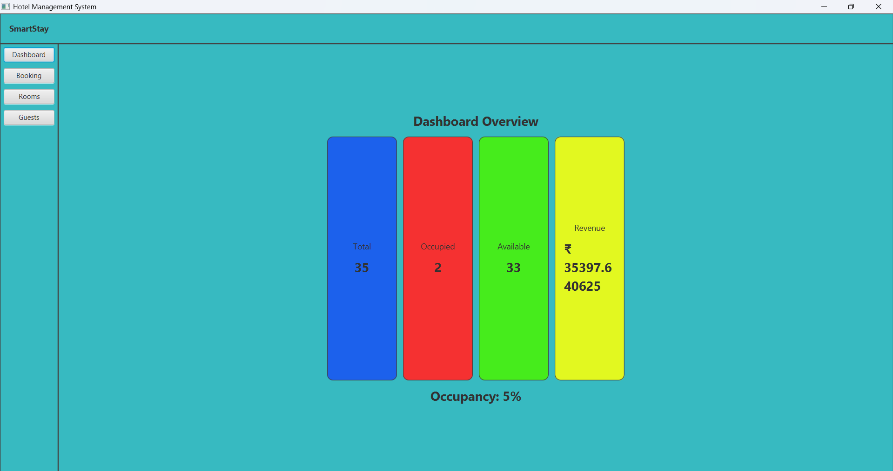
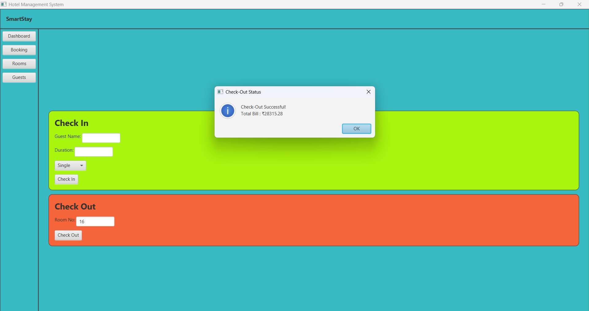
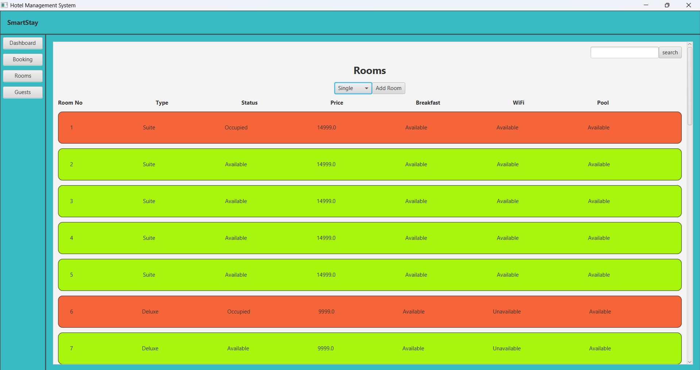
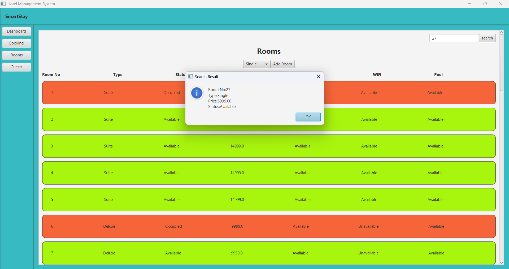
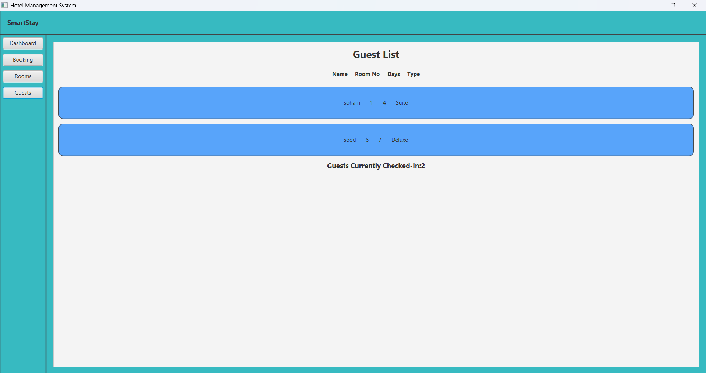
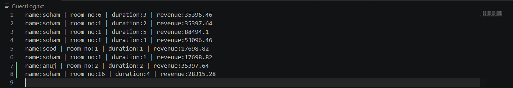
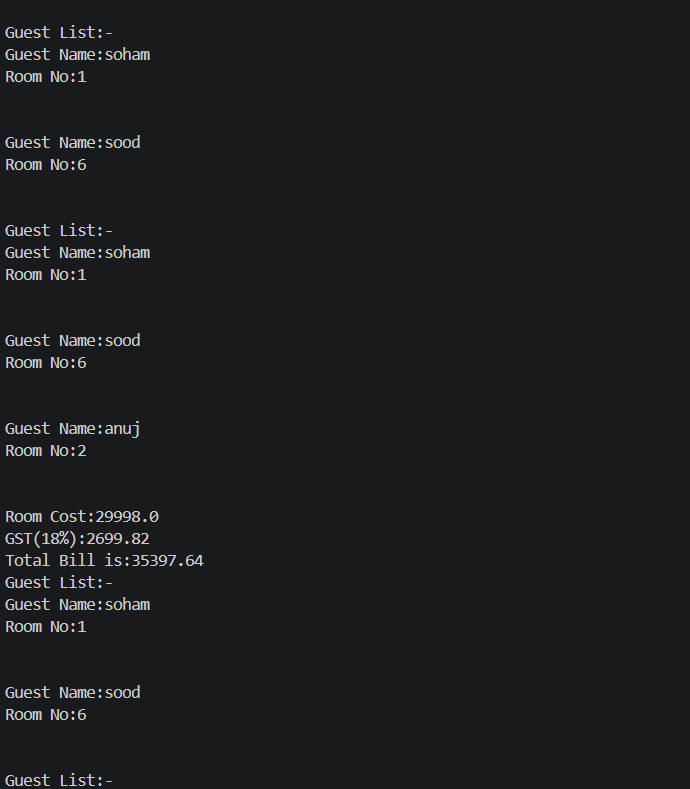

# Hotel_Management_System_App
A basic hotel management system built using java having a frontend made using javafx . Has basic features like a dashboard, booking and checkout options, viewing guestlist and room availability status, etc
# Hotel Management System App

## Dashboard

## Booking System

## Room Management

## Guest Management

# Terminal

